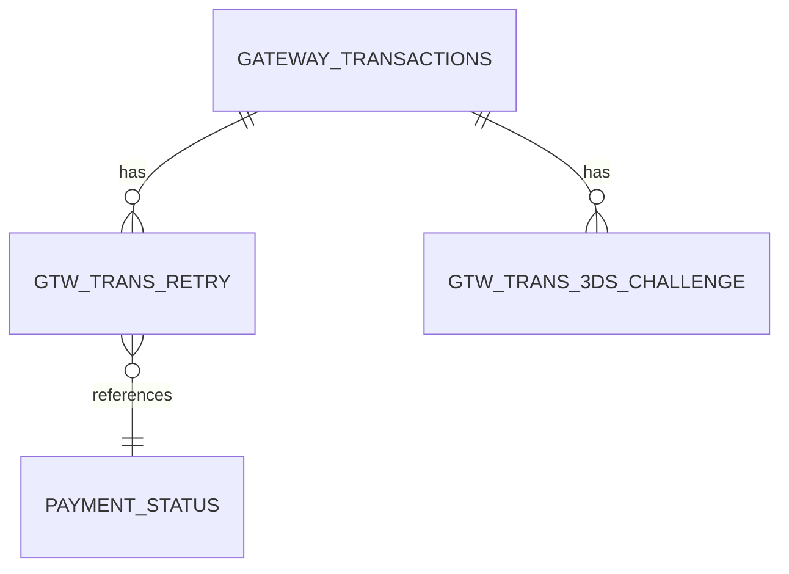

# Detailed Features Documentation

This document provides in-depth technical details about the MCP Database Performance tool's features.

---

## Table of Contents

1. [Business Logic Analysis](#business-logic-analysis)
2. [PostgreSQL Caching System](#postgresql-caching-system)
3. [Performance Monitoring](#performance-monitoring)
4. [Output Filtering Presets](#output-filtering-presets)
5. [Future Improvements](#future-improvements)

---

## Business Logic Analysis

### How It Works - Technical Deep Dive

#### 1. SQL Parsing & Table Extraction

The system uses regex patterns to extract table references from SQL queries:

```python
# Example SQL
SELECT t.payment_id, t.amount, r.retry_count
FROM gateway_transactions t
LEFT JOIN gtw_trans_retry r ON t.payment_id = r.payment_id
WHERE t.processing_date = '2024-01-01'

# Extracted tables
["GATEWAY_TRANSACTIONS", "GTW_TRANS_RETRY"]
```

**Pattern Matching:**
- Matches `FROM`, `JOIN`, `INTO`, `UPDATE` clauses
- Handles schema-qualified names (`SCHEMA.TABLE`)
- Resolves table aliases
- Filters out CTEs and inline views

#### 2. Schema Resolution

For unqualified table names, the system:
1. Queries `ALL_TABLES` to find the actual schema
2. Uses default schema (current user) if not found
3. Handles multiple schemas in complex queries

```sql
-- Query to resolve schema
SELECT owner, table_name
FROM ALL_TABLES
WHERE table_name = :table_name
  AND ROWNUM = 1
```

#### 3. Metadata Collection

The system collects comprehensive metadata from Oracle data dictionary:

**Table Metadata:**
```sql
SELECT t.table_name, t.num_rows, tc.comments
FROM ALL_TABLES t
LEFT JOIN ALL_TAB_COMMENTS tc
  ON t.owner = tc.owner
  AND t.table_name = tc.table_name
WHERE t.owner = :schema
  AND t.table_name = :table
```

**Column Metadata:**
```sql
SELECT
  col.column_name,
  col.data_type,
  col.nullable,
  cc.comments,
  col.column_id as position
FROM ALL_TAB_COLUMNS col
LEFT JOIN ALL_COL_COMMENTS cc
  ON col.owner = cc.owner
  AND col.table_name = cc.table_name
  AND col.column_name = cc.column_name
WHERE col.owner = :schema
  AND col.table_name = :table
ORDER BY col.column_id
```

**Primary Keys:**
```sql
SELECT cols.column_name
FROM ALL_CONSTRAINTS cons
JOIN ALL_CONS_COLUMNS cols
  ON cons.constraint_name = cols.constraint_name
  AND cons.owner = cols.owner
WHERE cons.constraint_type = 'P'
  AND cons.owner = :schema
  AND cons.table_name = :table
ORDER BY cols.position
```

**Foreign Key Relationships:**
```sql
SELECT
  a.table_name as from_table,
  a.column_name as from_column,
  c_pk.table_name as to_table,
  b.column_name as to_column,
  c.constraint_name
FROM ALL_CONS_COLUMNS a
JOIN ALL_CONSTRAINTS c
  ON a.constraint_name = c.constraint_name
  AND a.owner = c.owner
JOIN ALL_CONSTRAINTS c_pk
  ON c.r_constraint_name = c_pk.constraint_name
  AND c.r_owner = c_pk.owner
JOIN ALL_CONS_COLUMNS b
  ON c_pk.constraint_name = b.constraint_name
  AND c_pk.owner = b.owner
  AND a.position = b.position
WHERE c.constraint_type = 'R'
  AND c.owner = :schema
  AND c.table_name = :table
ORDER BY a.position
```

#### 4. Relationship Traversal

The system follows foreign keys recursively:

```
Query Tables: [A, B]
    ↓
Level 1: Find FKs from A, B → [C, D]
    ↓
Level 2: Find FKs from C, D → [E, F]
    ↓
Max Depth Reached: Stop
```

**Algorithm:**
1. Start with tables in query (Level 0)
2. For each table, find all outgoing FKs
3. Add referenced tables to next level
4. Repeat until max_depth reached
5. Deduplicate tables across levels

#### 5. Business Semantics Inference

The system infers business meaning from naming patterns:

**Entity Type Classification:**
```python
def infer_entity_type(table_name, columns):
    # Transaction patterns
    if any(keyword in table_name.lower() for keyword in ['transaction', 'trans', 'payment']):
        return "Transaction"

    # Master data patterns
    if any(keyword in table_name.lower() for keyword in ['customer', 'product', 'account']):
        return "Master Data"

    # Lookup table patterns
    if any(keyword in table_name.lower() for keyword in ['code', 'type', 'status', 'lookup']):
        return "Lookup"

    # Operational patterns
    if any(keyword in table_name.lower() for keyword in ['log', 'audit', 'history']):
        return "Operational"

    return "Unknown"
```

**Domain Classification:**
```python
DOMAIN_KEYWORDS = {
    "Payment Processing": ["payment", "transaction", "gateway", "card", "merchant"],
    "Order Management": ["order", "cart", "checkout", "shipment", "delivery"],
    "User Management": ["user", "account", "auth", "login", "profile"],
    "Inventory": ["product", "item", "stock", "warehouse", "inventory"],
    "Financial": ["invoice", "receipt", "billing", "ledger", "accounting"]
}

def infer_domain(table_name, columns, comments):
    # Check table name
    for domain, keywords in DOMAIN_KEYWORDS.items():
        if any(keyword in table_name.lower() for keyword in keywords):
            return domain

    # Check comments
    if comments:
        for domain, keywords in DOMAIN_KEYWORDS.items():
            if any(keyword in comments.lower() for keyword in keywords):
                return domain

    return "General"
```

**Table Type Classification:**
```python
def classify_table_type(num_rows, has_fks, has_timestamps):
    # Lookup tables: small, referenced by others
    if num_rows < 1000 and not has_fks:
        return "lookup"

    # Business tables: large, transactional
    if num_rows > 1_000_000 and has_timestamps:
        return "business"

    # Operational tables: moderate size, support tables
    if num_rows < 100_000 and has_fks:
        return "operational"

    return "unknown"
```

#### 6. Mermaid Diagram Generation

The system generates ER diagrams using Mermaid syntax:



**Cardinality Detection:**
- `||--o{` : One to many (PK to FK)
- `}o--||` : Many to one (FK to PK)
- `||--||` : One to one
- `}o--o{` : Many to many

---

## PostgreSQL Caching System

### Architecture

```
┌─────────────┐
│   Claude    │
│   Request   │
└──────┬──────┘
       │
       ▼
┌─────────────────────┐     Cache Lookup     ┌─────────────────┐
│   MCP Server        │──────────────────────>│   PostgreSQL    │
│   (knowledge_db.py) │                       │   Cache (omni)  │
└──────┬──────────────┘                       └─────────────────┘
       │                                              ▲
       │ Cache Miss                                   │
       ▼                                              │ Cache Save
┌─────────────────────┐                              │
│   Oracle Database   │──────────────────────────────┘
│   (Source of Truth) │
└─────────────────────┘
```

### Cache Schema Design

**table_knowledge** - Stores table metadata
```sql
CREATE TABLE mcp_performance.table_knowledge (
    id SERIAL PRIMARY KEY,
    db_name VARCHAR(100) NOT NULL,
    owner VARCHAR(100) NOT NULL,
    table_name VARCHAR(100) NOT NULL,

    -- Oracle metadata
    oracle_comment TEXT,
    num_rows BIGINT,
    is_partitioned BOOLEAN DEFAULT FALSE,
    partition_type VARCHAR(50),
    partition_key_columns TEXT[],

    -- Column details (JSONB for flexibility)
    columns JSONB,
    primary_key_columns TEXT[],

    -- Inferred semantics
    inferred_entity_type VARCHAR(100),
    inferred_domain VARCHAR(100),
    business_description TEXT,
    business_purpose TEXT,
    confidence_score FLOAT DEFAULT 0.5,

    -- Cache management
    last_refreshed TIMESTAMP DEFAULT NOW(),
    refresh_count INTEGER DEFAULT 1,

    UNIQUE(db_name, owner, table_name)
);

-- Indexes for fast lookup
CREATE INDEX idx_table_knowledge_lookup
    ON mcp_performance.table_knowledge(db_name, owner, table_name);

CREATE INDEX idx_table_knowledge_freshness
    ON mcp_performance.table_knowledge(last_refreshed)
    WHERE last_refreshed > NOW() - INTERVAL '7 days';
```

**relationship_knowledge** - Stores foreign key relationships
```sql
CREATE TABLE mcp_performance.relationship_knowledge (
    id SERIAL PRIMARY KEY,
    db_name VARCHAR(100) NOT NULL,

    -- From side (child table)
    from_schema VARCHAR(100) NOT NULL,
    from_table VARCHAR(100) NOT NULL,
    from_columns TEXT[] NOT NULL,

    -- To side (parent table)
    to_schema VARCHAR(100) NOT NULL,
    to_table VARCHAR(100) NOT NULL,
    to_columns TEXT[] NOT NULL,

    -- Relationship metadata
    constraint_name VARCHAR(200),
    relationship_type VARCHAR(10) DEFAULT 'FK',

    -- Cache management
    last_refreshed TIMESTAMP DEFAULT NOW(),

    UNIQUE(db_name, from_schema, from_table, to_schema, to_table, constraint_name)
);

-- Indexes for relationship traversal
CREATE INDEX idx_relationship_from
    ON mcp_performance.relationship_knowledge(db_name, from_schema, from_table);

CREATE INDEX idx_relationship_to
    ON mcp_performance.relationship_knowledge(db_name, to_schema, to_table);
```

### Cache Lookup Algorithm

```python
async def get_table_knowledge(db_name: str, owner: str, table_name: str):
    """
    Retrieve table knowledge with TTL-based freshness check.
    """
    # 1. Generate cache key
    cache_key = (db_name, owner.upper(), table_name.upper())

    # 2. Query PostgreSQL with TTL filter
    query = """
        SELECT *
        FROM mcp_performance.table_knowledge
        WHERE db_name = $1
          AND owner = $2
          AND table_name = $3
          AND last_refreshed > NOW() - INTERVAL '7 days'
    """

    result = await conn.fetchrow(query, *cache_key)

    # 3. Cache hit - return cached data
    if result:
        logger.info(f"✅ CACHE HIT: {owner}.{table_name}")
        return dict(result)

    # 4. Cache miss - fetch from Oracle
    logger.info(f"📭 CACHE MISS: {owner}.{table_name}")
    oracle_data = await fetch_from_oracle(db_name, owner, table_name)

    # 5. Save to cache
    await save_to_cache(db_name, owner, table_name, oracle_data)

    return oracle_data
```

### Cache Performance Optimizations

**1. Batch Lookups**
```python
async def get_tables_knowledge_batch(
    db_name: str,
    tables: List[Tuple[str, str]]
) -> Dict[Tuple[str, str], Dict]:
    """
    Fetch multiple tables in a single query.
    """
    owners = [owner.upper() for owner, _ in tables]
    table_names = [table.upper() for _, table in tables]

    # Single query with ANY operator
    query = """
        SELECT *
        FROM mcp_performance.table_knowledge
        WHERE db_name = $1
          AND last_refreshed > NOW() - INTERVAL '7 days'
          AND owner = ANY($2::text[])
          AND table_name = ANY($3::text[])
    """

    rows = await conn.fetch(query, db_name, owners, table_names)

    # Map results by (owner, table)
    return {(r['owner'], r['table_name']): dict(r) for r in rows}
```

**Performance:** 10 tables in 9ms vs 10 individual queries in 50ms (5.5x faster)

**2. Connection Pooling**
```python
# asyncpg connection pool
pool = await asyncpg.create_pool(
    host='omni_db',
    port=5432,
    database='omni',
    user='omni',
    password='omni',
    min_size=1,
    max_size=10
)
```

**3. JSONB for Columns**
- Stores column array as JSON for flexibility
- Faster than joining multiple tables
- Supports partial column updates

---

## Performance Monitoring

### Database Health Monitoring

**Tool:** `get_database_health(db_name, time_range_minutes)`

**Metrics Collected:**
```sql
-- CPU Usage
SELECT
    ROUND(value, 2) as cpu_usage
FROM V$OSSTAT
WHERE stat_name = 'NUM_CPUS'

-- Active Sessions
SELECT COUNT(*) as active_sessions
FROM V$SESSION
WHERE status = 'ACTIVE'
  AND type = 'USER'

-- Buffer Cache Hit Ratio
SELECT
    ROUND(1 - (physical.value / logical.value), 4) * 100 as hit_ratio
FROM V$SYSSTAT physical, V$SYSSTAT logical
WHERE physical.name = 'physical reads'
  AND logical.name = 'db block gets' + 'consistent gets'

-- Top Wait Events
SELECT
    event,
    time_waited_micro / 1000000 as time_waited_sec
FROM V$SYSTEM_EVENT
WHERE wait_class != 'Idle'
ORDER BY time_waited DESC
FETCH FIRST 5 ROWS ONLY
```

### Top Queries Analysis

**Tool:** `get_top_queries(db_name, metric, top_n, time_range_hours)`

**Supported Metrics:**
- `cpu_time` - CPU seconds consumed
- `elapsed_time` - Total execution time
- `buffer_gets` - Logical reads
- `executions` - Number of times executed

**Query:**
```sql
SELECT
    sql_id,
    sql_text,
    executions,
    cpu_time / 1000000 as cpu_seconds,
    elapsed_time / 1000000 as elapsed_seconds,
    buffer_gets,
    disk_reads,
    first_load_time,
    last_active_time
FROM V$SQL
WHERE parsing_schema_name NOT IN ('SYS', 'SYSTEM', 'DBSNMP')
  AND command_type = 3  -- SELECT statements
  AND last_active_time > SYSDATE - :time_range_hours/24
ORDER BY cpu_time DESC
FETCH FIRST :top_n ROWS ONLY
```

---

## Output Filtering Presets

Control the amount of data returned using `output_preset` in `server/config.py`:

### Standard (Full Data)
```python
OUTPUT_PRESET = "standard"
```

**Returns:** Everything
- Full execution plan text
- All table/index statistics
- All column statistics
- All constraints
- All optimizer parameters
- All segment sizes

**Token Usage:** 15,000-40,000 tokens
**Use When:** Deep optimization, 1-5 table queries

### Compact (Filtered)
```python
OUTPUT_PRESET = "compact"
```

**Returns:** Plan-relevant data only
- Structured plan details (no text)
- Table/index stats for plan objects only
- All column stats (needed for cardinality)
- All constraints (needed for relationships)
- Segment sizes for plan objects only

**Token Usage:** 6,000-18,000 tokens
**Use When:** Production queries, routine analysis

### Minimal (Essentials)
```python
OUTPUT_PRESET = "minimal"
```

**Returns:** Bare minimum
- Structured plan details
- Basic table stats (name, rows, blocks)
- Summary counts only

**Token Usage:** 1,500-4,500 tokens
**Use When:** Quick checks, 20+ table queries

### Impact on Analysis Quality

| Feature | Standard | Compact | Minimal |
|---------|----------|---------|---------|
| Index Recommendations | ✅ Full | ⚠️ Partial | ❌ None |
| Constraint Analysis | ✅ Yes | ✅ Yes | ❌ No |
| Storage Insights | ✅ Yes | ⚠️ Partial | ❌ No |
| Cost Analysis | ✅ Full | ✅ Full | ✅ Basic |

---

## Future Improvements

### High Priority

1. **MySQL Business Logic Analysis**
   - Extend `explain_business_logic` to support MySQL
   - MySQL information_schema integration
   - Cross-database comparison

2. **Cache Warming**
   - Pre-populate cache on server startup
   - Background job to refresh stale entries
   - Predictive warming based on query history

3. **Admin UI**
   - Web interface for cache management
   - Manual table documentation overrides
   - Cache statistics dashboard

4. **ML-Based Entity Inference**
   - Train model on existing table patterns
   - Improve accuracy of business semantics
   - Learn from user corrections

### Medium Priority

5. **Natural Language Summaries**
   - Generate business summaries using LLM
   - Convert technical details to plain English
   - Create documentation automatically

6. **Query Pattern Recognition**
   - Detect N+1 queries
   - Identify pagination patterns
   - Suggest query consolidation

7. **Composite Foreign Keys**
   - Support multi-column FKs
   - More accurate relationship detection

8. **Views and Materialized Views**
   - Include views in relationship analysis
   - Detect view dependencies

### Low Priority

9. **Export Capabilities**
   - PNG/SVG diagram export
   - dbdocs.io integration
   - Data lineage visualization

10. **Synonym Support**
    - Handle Oracle synonyms
    - Database links
    - Cross-schema references

### Performance Improvements

11. **Redis Caching Layer**
    - Sub-100ms response times
    - Hot data in Redis
    - Cold data in PostgreSQL

12. **Partial Cache Updates**
    - Update only changed columns
    - Incremental refresh
    - Reduce Oracle load

13. **Background Processing**
    - Queue-based architecture
    - Async cache refresh
    - Non-blocking responses

### Security & Compliance

14. **Audit Logging**
    - Log all cache accesses
    - Track who views sensitive tables
    - Compliance reporting

15. **Row-Level Security**
    - Filter cached data by user
    - Respect Oracle VPD policies

16. **PII Detection**
    - Identify sensitive columns
    - Mask PII in responses
    - Compliance warnings

---

## Contributing

We welcome contributions! Areas needing help:

- MySQL support for business logic
- Performance optimizations
- Documentation improvements
- Test coverage
- UI/UX enhancements

See the main [README](README.md) for contribution guidelines.

---

**Last Updated:** January 16, 2026
**Version:** 1.0
**Status:** Production Ready
