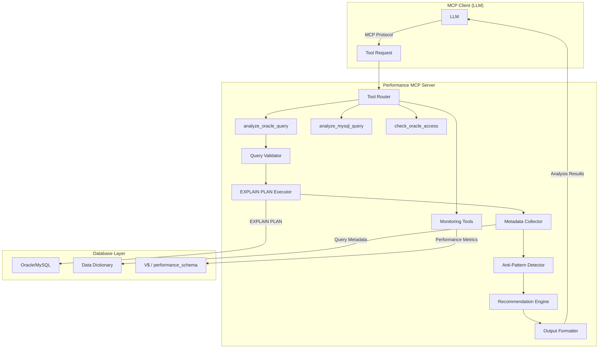
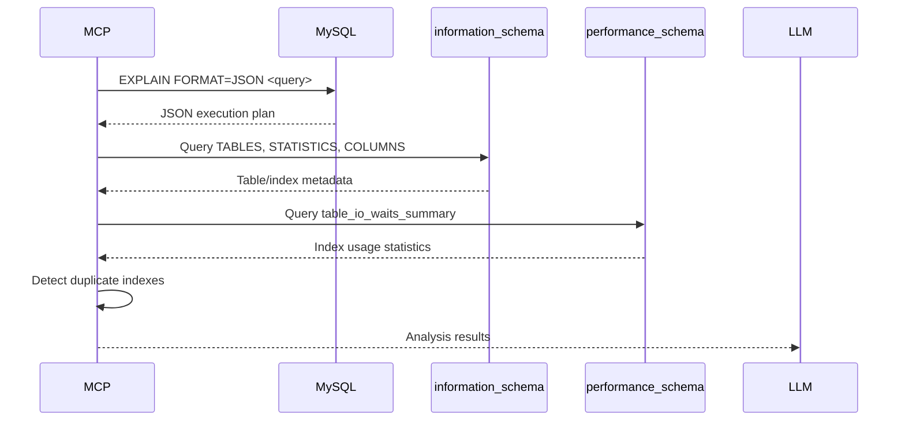
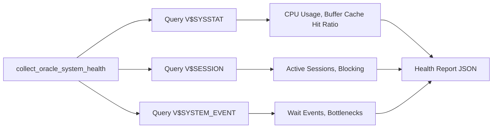
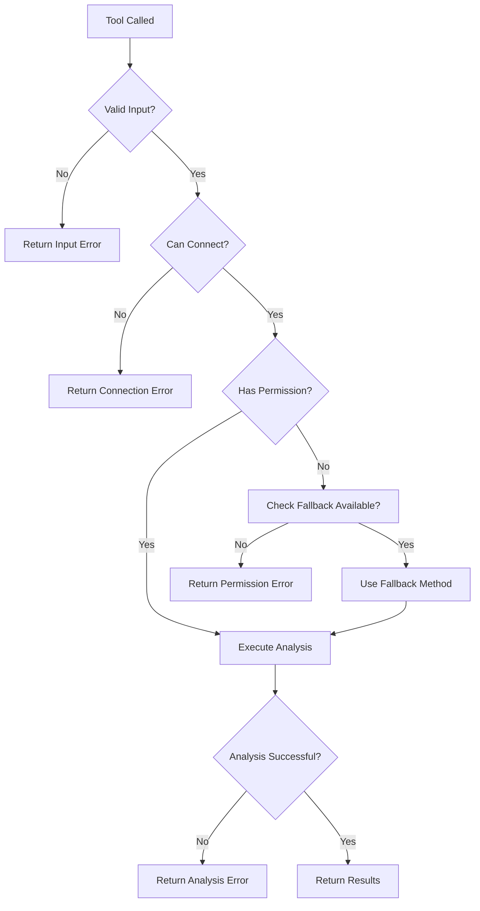

# Performance MCP Architecture

Understanding how Performance MCP works internally, how presets affect analysis, and how data flows through the system.

---

## System Architecture



---

## How Oracle Analysis Works

### Phase 1: Query Validation (< 100ms)

```python
def analyze_oracle_query(sql_query, db_preset, output_preset="compact"):
    # 1. Validate it's a SELECT query
    if not sql_query.strip().upper().startswith("SELECT"):
        raise ValueError("Only SELECT queries supported")
    
    # 2. Check database exists in settings.yaml
    db_config = config.get_database(db_preset)
    
    # 3. Establish connection
    conn = db_connector.connect(db_preset)
```

### Phase 2: EXPLAIN PLAN Generation (< 1s)

```sql
-- MCP executes this (no actual query execution):
EXPLAIN PLAN FOR
  <user's SQL query>

-- Then retrieves the plan:
SELECT * FROM TABLE(DBMS_XPLAN.DISPLAY(FORMAT=>'ALL'))
```

**Key Point:** The user's SELECT query is NEVER actually run. Only the plan is generated.

### Phase 3: Metadata Collection (1-3s)

Behavior depends on `output_preset`:

#### Preset: `minimal`
```sql
-- Only tables in plan + row counts
SELECT owner, table_name, num_rows
FROM all_tables
WHERE (owner, table_name) IN (
  -- Tables extracted from EXPLAIN PLAN
)
```

#### Preset: `compact` (RECOMMENDED)
```sql
-- Tables in plan + essential stats
SELECT owner, table_name, num_rows, blocks, avg_row_len, last_analyzed
FROM all_tables
WHERE (owner, table_name) IN (...);

SELECT owner, index_name, table_name, uniqueness, clustering_factor
FROM all_indexes
WHERE (owner, table_name) IN (...);

SELECT owner, index_name, column_name, column_position
FROM all_ind_columns
WHERE (owner, table_name) IN (...);
```

#### Preset: `standard`
```sql
-- ALL tables in database + full metadata
SELECT * FROM all_tables;              -- All tables
SELECT * FROM all_indexes;             -- All indexes
SELECT * FROM all_ind_columns;         -- Index composition
SELECT * FROM all_constraints;         -- PK/FK/UK
SELECT * FROM all_cons_columns;        -- Constraint columns
SELECT * FROM all_tab_col_statistics;  -- Histograms, NDV
SELECT * FROM all_tab_partitions;      -- Partition info
SELECT parameter, value FROM v$parameter;  -- Optimizer config
```

### Phase 4: Anti-Pattern Detection (< 500ms)

```python
def detect_anti_patterns(execution_plan, table_stats):
    anti_patterns = {
        "full_table_scans": [],
        "cartesian_products": [],
        "stale_statistics": []
    }
    
    # Check for full scans on large tables
    for operation in execution_plan:
        if operation['operation'] == 'TABLE ACCESS FULL':
            table = operation['object_name']
            if table_stats[table]['num_rows'] > 10000:
                anti_patterns["full_table_scans"].append({
                    "table": table,
                    "rows": table_stats[table]['num_rows'],
                    "severity": "HIGH" if num_rows > 1000000 else "MEDIUM"
                })
    
    # Check for Cartesian products
    if 'MERGE JOIN CARTESIAN' in plan_operations:
        anti_patterns["cartesian_products"].append(...)
    
    # Check for stale statistics
    for table, stats in table_stats.items():
        if (today - stats['last_analyzed']).days > 30:
            anti_patterns["stale_statistics"].append(...)
    
    return anti_patterns
```

### Phase 5: Recommendation Generation (< 200ms)

```python
def generate_recommendations(anti_patterns, execution_plan, indexes):
    recommendations = []
    
    # For each full scan, check if index exists
    for scan in anti_patterns["full_table_scans"]:
        table = scan["table"]
        where_columns = extract_where_columns(execution_plan, table)
        
        for col in where_columns:
            if not index_exists_on(table, col, indexes):
                recommendations.append({
                    "type": "CREATE_INDEX",
                    "priority": "HIGH",
                    "suggestion": f"CREATE INDEX idx_{table}_{col} ON {table}({col})",
                    "reason": f"Full scan on {scan['rows']} rows, WHERE uses {col}",
                    "estimated_improvement": "80-95% cost reduction"
                })
    
    return recommendations
```

### Phase 6: Output Formatting

```python
def format_output(execution_plan, metadata, anti_patterns, recommendations, output_preset):
    result = {
        "database": db_preset,
        "query_analysis": {
            "execution_plan": execution_plan,
            "anti_patterns": anti_patterns,
            "recommendations": recommendations
        }
    }
    
    if output_preset == "standard":
        result["query_analysis"]["tables"] = metadata["all_tables"]
        result["query_analysis"]["indexes"] = metadata["all_indexes"]
        result["query_analysis"]["constraints"] = metadata["constraints"]
        # ... everything
    elif output_preset == "compact":
        result["query_analysis"]["tables"] = metadata["plan_tables_only"]
        result["query_analysis"]["indexes"] = metadata["plan_indexes_only"]
        # Essential metadata only
    elif output_preset == "minimal":
        result["query_analysis"]["tables"] = {
            t: {"num_rows": metadata["tables"][t]["num_rows"]} 
            for t in plan_tables
        }
        # Just row counts
    
    return result
```

---

## Output Preset Comparison

### Token Usage by Preset

| Preset | Small Query (2 tables) | Medium Query (5 tables) | Large Query (10+ tables) |
|--------|----------------------|------------------------|-------------------------|
| **minimal** | ~1.5K tokens | ~3K tokens | ~5K tokens |
| **compact** | ~6K tokens | ~12K tokens | ~20K tokens |
| **standard** | ~15K tokens | ~30K tokens | ~40K+ tokens |

### What Each Preset Includes

| Feature | minimal | compact | standard |
|---------|---------|---------|----------|
| Execution plan (JSON) | ✅ | ✅ | ✅ |
| Execution plan (text) | ❌ | ❌ | ✅ |
| Table row counts | ✅ | ✅ | ✅ |
| Table blocks/size | ❌ | ✅ | ✅ |
| Index structure | ❌ | ✅ Plan tables only | ✅ All indexes |
| Column statistics | ❌ | ❌ | ✅ |
| Constraints/FKs | ❌ | ❌ | ✅ |
| Partition info | ❌ | ❌ | ✅ |
| Optimizer params | ❌ | ❌ | ✅ |
| Storage sizing | ❌ | ❌ | ✅ |
| Anti-pattern detection | ✅ Basic | ✅ Full | ✅ Full |
| Recommendations | ✅ | ✅ | ✅ |

### Execution Time by Preset

| Preset | Metadata Queries | Typical Time |
|--------|-----------------|--------------|
| **minimal** | 1 query (table stats only) | 0.5 - 1s |
| **compact** | 3-4 queries (tables, indexes, columns) | 1.5 - 3s |
| **standard** | 8-10 queries (everything) | 3 - 5s |

---

## MySQL Analysis Differences

### MySQL-Specific Architecture



### Key Differences from Oracle

| Aspect | Oracle | MySQL |
|--------|--------|-------|
| **Plan Format** | PLAN_TABLE + DBMS_XPLAN | EXPLAIN FORMAT=JSON |
| **Metadata Source** | ALL_TABLES, ALL_INDEXES | information_schema |
| **Runtime Stats** | V$ views | performance_schema |
| **Unique Feature** | Optimizer parameters | Index usage tracking |
| **Token Cost** | 5K-40K | 5K-20K (typically smaller) |

---

## Configuration Deep Dive

### settings.yaml Structure

```yaml
oracle_analysis:
  output_preset: "compact"  # Global default
  
  core:
    execution_plan:
      enabled: true  # Cannot be disabled
      
  metadata:
    table_statistics:
      enabled: true
      criticality: HIGH
      tables_accessed: [ALL_TABLES]
    
    index_statistics:
      enabled: true
      criticality: HIGH
      tables_accessed: [ALL_INDEXES, ALL_IND_COLUMNS]
    
    column_statistics:
      enabled: true
      criticality: HIGH
      tables_accessed: [ALL_TAB_COL_STATISTICS]
    
    constraints:
      enabled: true
      criticality: HIGH
      tables_accessed: [ALL_CONSTRAINTS, ALL_CONS_COLUMNS]
  
  optimizer:
    parameters:
      enabled: true
      requires_privileges: SELECT on V$PARAMETER
      fallback_on_error: true  # Continue if no access
  
  storage:
    segment_sizes:
      enabled: true
      requires_privileges: SELECT on DBA_SEGMENTS
      fallback: "Calculate from blocks * block_size"
```

### Feature Flags Impact

When a feature is disabled or access fails:

```python
# If optimizer.parameters is disabled or fails:
# - Analysis continues
# - "Optimizer configuration unavailable" message
# - Cannot explain WHY optimizer chose specific plan

# If storage.segment_sizes fails (common for non-DBA users):
# - Falls back to: table_size_mb = (blocks * block_size) / 1024 / 1024
# - Less accurate but functional
```

---

## Caching and Performance

### What is NOT Cached

- **Execution plans** - Always fresh (optimizer may change behavior)
- **Anti-pattern detection** - Recalculated each time
- **Recommendations** - Generated fresh based on current state

### What COULD Be Cached (Future Enhancement)

- **Metadata** for same table (24-hour TTL)
- **Database structure** (rarely changes)
- **Optimizer parameters** (rarely changes)

**Current Status:** No caching implemented (always fresh data)

---

## Security Model

### Read-Only Architecture

```python
# All tools follow this pattern:
def analyze_oracle_query(sql_query, db_preset):
    # 1. Validate SELECT only
    if not is_select_query(sql_query):
        raise SecurityError("Only SELECT queries allowed")
    
    # 2. Use read-only connection
    conn = db_connector.connect(db_preset, read_only=True)
    
    # 3. Never execute actual query
    cursor.execute(f"EXPLAIN PLAN FOR {sql_query}")  # Simulation only
    
    # 4. Only query data dictionary (metadata, not user data)
    cursor.execute("SELECT * FROM all_tables WHERE ...")
    
    return results
```

### What MCP Server CANNOT Do

❌ Execute DML (INSERT/UPDATE/DELETE)  
❌ Execute DDL (CREATE/ALTER/DROP)  
❌ Execute DCL (GRANT/REVOKE)  
❌ Read actual user data (only metadata)  
❌ Modify database schema or data  

✅ Can only: Generate EXPLAIN plans, read data dictionary

---

## Monitoring Tools Architecture

### Real-Time Oracle Monitoring



**Data Sources:**
- `V$SYSSTAT` - System-wide statistics
- `V$SESSION` - Current session info
- `V$SYSTEM_EVENT` - Wait event statistics
- `V$SQL` - Top SQL by various metrics

**Update Frequency:** Real-time (queries current state each time)

---

## Error Handling Flow



### Graceful Degradation

- **DBA_SEGMENTS unavailable** → Calculate from blocks * block_size
- **V$PARAMETER unavailable** → Skip optimizer config section
- **Column statistics unavailable** → Basic analysis without cardinality insights

---

## Best Practices for Developers

### Adding New Tools

1. Use `@mcp.tool()` decorator
2. Include detailed description (used by autodiscovery)
3. Follow security model (read-only)
4. Implement graceful degradation for missing permissions
5. Log at appropriate levels (INFO for normal, WARNING for fallbacks)
6. Add tool documentation to `knowledge_base/tools/{tool_name}.md`

### Adding New Features

1. Add feature flag to `settings.yaml`
2. Document in `architecture.md`
3. Handle permission errors gracefully
4. Update output preset logic if affects token usage
5. Add tests for new functionality

---

## See Also

- [Overview](overview.md) - High-level MCP capabilities
- [Workflows](workflows.md) - How to use the tools
- [Troubleshooting](troubleshooting.md) - Common issues
