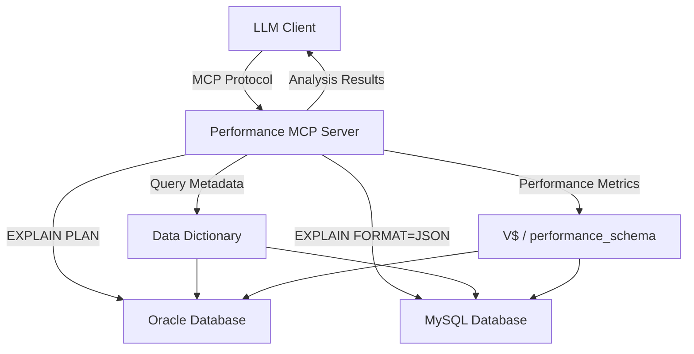

# Performance MCP Overview

## What is Performance MCP?

**Performance MCP Server** is a specialized Model Context Protocol server that analyzes SQL query performance **without executing queries**. It specializes in execution plan analysis, metadata collection, and performance troubleshooting for Oracle and MySQL databases.

### Unique Value Proposition

- **Read-Only Analysis**: Generates EXPLAIN plans without executing queries or modifying data
- **Metadata Intelligence**: Collects table/index statistics to explain optimizer decisions
- **Anti-Pattern Detection**: Automatically identifies performance issues (full scans, Cartesian products)
- **Optimization Verification**: Compares before/after plans to prove improvements

---

## What This MCP Does

✅ **Execution Plan Analysis**
- Generates execution plans (EXPLAIN PLAN) without running queries
- Analyzes optimizer decisions and cost calculations
- Identifies expensive operations (sorts, joins, scans)

✅ **Metadata Collection**
- Table statistics (row counts, size, last analyzed date)
- Index structure and clustering factors
- Column statistics and histograms
- Foreign key relationships and constraints
- Partition information

✅ **Performance Anti-Pattern Detection**
- Full table scans on large tables (factual detection, not guessing)
- Cartesian products from missing join conditions
- Missing indexes on WHERE/JOIN columns
- Stale statistics that mislead the optimizer

✅ **Query Optimization Workflow**
- Compare query plans before/after changes
- Verify index effectiveness
- Suggest query rewrites
- Estimate performance impact

✅ **Real-Time Monitoring** (Oracle only)
- Current database health metrics
- Active session monitoring
- Top expensive queries
- Wait event analysis

✅ **Business Logic Mapping**
- Foreign key relationship diagrams
- Table/column comments
- Query intent detection

---

## What This MCP Does NOT Do

❌ **Does NOT execute queries or return data rows**
- Security: Only EXPLAIN PLAN, never actual SELECT execution
- Use case: This is for analysis, not data retrieval

❌ **Does NOT modify database schema or data**
- No DML (INSERT/UPDATE/DELETE)
- No DDL (CREATE/ALTER/DROP)
- No DCL (GRANT/REVOKE)
- 100% read-only operations

❌ **Does NOT perform ETL or data transformation**
- Use dedicated ETL/integration MCPs for data movement

❌ **Does NOT manage users or permissions**
- Requires pre-configured database credentials in settings.yaml

---

## Supported Databases

| Database | Versions | Features |
|----------|----------|----------|
| **Oracle** | 11g - 21c | Full support: EXPLAIN PLAN, metadata, monitoring |
| **MySQL** | 5.7 - 8.0+ | Full support: EXPLAIN FORMAT=JSON, metadata, index usage |

---

## When to Use This MCP

### ✅ Use Performance MCP When:

1. **Slow Query Investigation**
   - User: "This query takes 5 minutes, why?"
   - Solution: Analyze execution plan, identify bottlenecks

2. **Query Optimization**
   - User: "How can I make this query faster?"
   - Solution: Suggest indexes, rewrites, verify with plan comparison

3. **Legacy Query Understanding**
   - User: "What does this 500-line query do?"
   - Solution: Map relationships, explain business logic

4. **Pre-Deployment Verification**
   - User: "Will this new index help?"
   - Solution: Compare plans before/after optimization

5. **Performance Troubleshooting**
   - User: "Database is slow today"
   - Solution: Real-time monitoring, identify top expensive queries

6. **Permission Verification**
   - User: "Do I have access to analyze production queries?"
   - Solution: Check Oracle/MySQL access to required metadata views

### ❌ Don't Use Performance MCP When:

- User wants to execute queries and get results → Use data query MCP
- User wants to modify data/schema → This MCP is read-only
- User needs ETL/data transformation → Use integration MCP
- User needs user management → Use admin tools

---

## Security Model

**READ-ONLY: SELECT queries only**

- ✅ SELECT on data dictionary views (ALL_TABLES, information_schema.TABLES, etc.)
- ✅ EXPLAIN PLAN simulation (never executes actual query)
- ✅ Performance schema access (V$SESSION, performance_schema, etc.)
- ❌ No DML/DDL/DCL commands accepted
- ❌ No data modification possible
- ❌ No privilege escalation

---

## Architecture Overview

### How Analysis Works

1. **Query Received** - LLM calls `analyze_oracle_query()` or `analyze_mysql_query()`
2. **Plan Generation** - MCP executes EXPLAIN PLAN (simulation only, no actual execution)
3. **Metadata Collection** - Query data dictionary for table/index statistics
4. **Anti-Pattern Detection** - Analyze plan for performance issues
5. **Result Formatting** - Return structured JSON with findings and recommendations

---

## Available Tools

**Total: 12+ tools across 3 categories**

| Category | Tool Count | Examples |
|----------|-----------|----------|
| Oracle Analysis | 5 | analyze_oracle_query, compare_oracle_plans, check_oracle_access |
| MySQL Analysis | 3 | analyze_mysql_query, check_mysql_access |
| Monitoring | 4 | collect_oracle_system_health, get_oracle_top_queries |

See [tools/](tools/) directory for detailed documentation of each tool.

---

## Configuration Presets

### Output Presets (Control Token Usage)

Performance MCP uses configurable presets to balance detail vs. token efficiency:

| Preset | Token Size | Use Case | Includes |
|--------|-----------|----------|----------|
| **standard** | 15-40K | Deep analysis, index tuning projects | Everything: full plans, all metadata, constraints |
| **compact** | 6-20K | Routine analysis (RECOMMENDED) | Plan + essential metadata only |
| **minimal** | 1.5-5K | Quick checks, large queries | Plan + row counts only |

**Current preset:** Check `settings.yaml` → `oracle_analysis.output_preset` or `mysql_analysis.output_preset`

See [architecture.md#output-presets](architecture.md#output-presets) for detailed impact analysis.

---

## Next Steps

- **New users:** Read [workflows.md](workflows.md) for step-by-step guides
- **Troubleshooting:** See [troubleshooting.md](troubleshooting.md) for common errors
- **Tool reference:** Browse [tools/](tools/) for detailed tool documentation
- **Advanced:** Read [architecture.md](architecture.md) to understand internals

---

## Related MCPs

- **informatica-mcp** - Informatica PowerCenter workflow monitoring
- **qa-mcp** - QA automation and CSV comparison
- **omni2** - Multi-LLM orchestration and analytics
