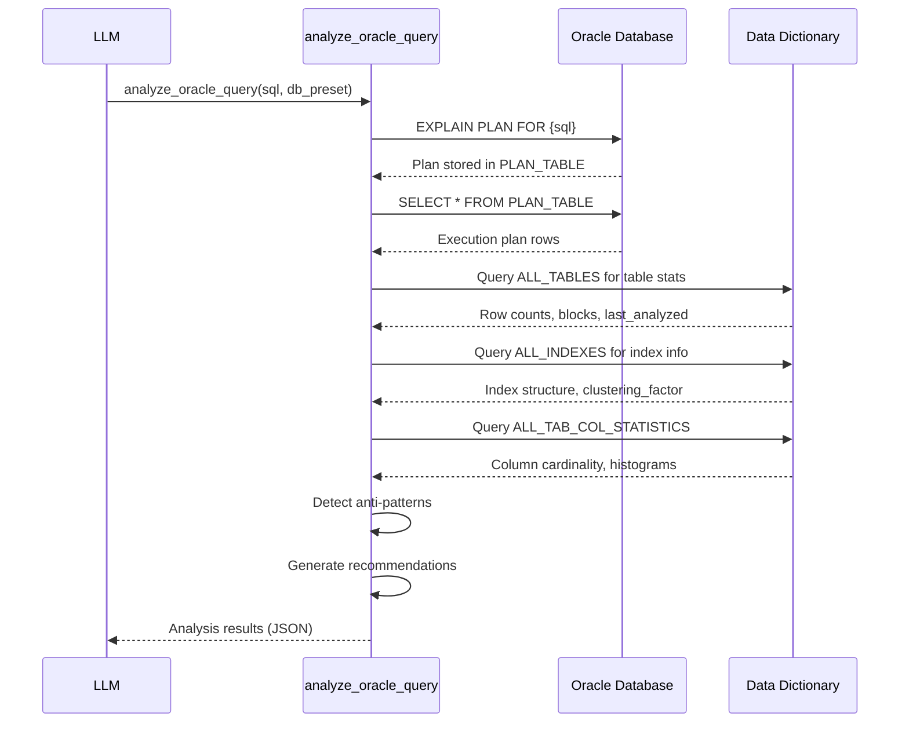

# analyze_oracle_query

**Category:** Oracle Analysis  
**Database:** Oracle Only  
**Purpose:** Comprehensive Oracle query performance analysis without execution

---

## Overview

`analyze_oracle_query` is the primary tool for analyzing Oracle SQL query performance. It generates an execution plan, collects metadata from Oracle's data dictionary, detects performance anti-patterns, and provides optimization recommendations—all without executing the actual query.

---

## When to Use

✅ **Use this tool when:**
- User has a slow Oracle query
- Need to understand query execution strategy
- Looking for optimization opportunities
- Investigating why a query changed behavior
- Pre-deployment verification of query changes

❌ **Don't use when:**
- Query is MySQL (use `analyze_mysql_query`)
- Need to execute query and get results (this MCP doesn't execute)
- Query contains DML/DDL (INSERT/UPDATE/DELETE/CREATE) - only SELECT supported

---

## Parameters

| Parameter | Type | Required | Default | Description |
|-----------|------|----------|---------|-------------|
| `sql_query` | string | ✅ Yes | - | The SELECT query to analyze |
| `db_preset` | string | ✅ Yes | - | Database name from settings.yaml |
| `output_preset` | string | ❌ No | "compact" | Output detail level: standard \| compact \| minimal |

---

## How It Works



### Steps in Detail:

1. **Query Validation** - Verify it's a SELECT statement
2. **EXPLAIN PLAN** - Generate execution plan (NO execution)
3. **Metadata Collection** - Based on `output_preset`:
   - **standard:** All tables/indexes in database + full stats
   - **compact:** Only tables in plan + essential stats
   - **minimal:** Only tables in plan + row counts
4. **Anti-Pattern Detection** - Identify full scans, Cartesian products
5. **Recommendation Generation** - Suggest indexes, rewrites
6. **Output Formatting** - Return structured JSON

---

## Output Presets Impact

### Preset: `standard` (40K tokens)

**Best for:** Deep analysis, index tuning projects, documentation

**Includes:**
- Full execution plan with all steps
- ALL tables/indexes in database (even if not in query)
- Complete column statistics with histograms
- All constraints and foreign keys
- Partition information
- Optimizer parameters
- Storage sizing (if DBA_SEGMENTS accessible)

**Use when:** You need comprehensive details or are tuning complex queries

### Preset: `compact` (20K tokens) **← RECOMMENDED**

**Best for:** Routine analysis, daily optimization work

**Includes:**
- Execution plan (JSON format only)
- Only tables/indexes mentioned in the query
- Essential statistics (rows, blocks, cardinality)
- Anti-pattern detections
- Optimization recommendations

**Use when:** Most analysis scenarios (90% of cases)

### Preset: `minimal` (5K tokens)

**Best for:** Quick checks, large queries, token limits

**Includes:**
- Execution plan basics
- Table row counts only
- Major anti-patterns only

**Use when:** You just need to see the plan quickly

---

## Output Structure

```json
{
  "database": "transformer_prod",
  "query_analysis": {
    "execution_plan": {
      "operation_tree": [...],
      "estimated_cost": 8234,
      "estimated_rows": 125000,
      "estimated_bytes": 5000000
    },
    "tables": {
      "ORDERS": {
        "owner": "STG",
        "num_rows": 5000000,
        "blocks": 65000,
        "avg_row_len": 128,
        "last_analyzed": "2025-01-05"
      }
    },
    "indexes": {
      "PK_ORDERS": {
        "columns": ["ORDER_ID"],
        "uniqueness": "UNIQUE",
        "clustering_factor": 64234,
        "distinct_keys": 5000000
      }
    },
    "anti_patterns": {
      "full_table_scans": [
        {
          "table": "ORDERS",
          "rows": 5000000,
          "severity": "HIGH",
          "reason": "No index on ORDER_DATE column in WHERE clause"
        }
      ],
      "cartesian_detections": [],
      "stale_statistics": []
    },
    "recommendations": [
      {
        "type": "CREATE_INDEX",
        "priority": "HIGH",
        "suggestion": "CREATE INDEX idx_orders_date ON orders(order_date)",
        "reason": "Full scan on 5M rows, WHERE clause uses order_date",
        "estimated_improvement": "80-95% cost reduction"
      }
    ]
  },
  "metadata": {
    "output_preset_used": "compact",
    "analysis_timestamp": "2025-01-06T10:30:00Z",
    "token_estimate": "~20K"
  }
}
```

---

## Common Anti-Patterns Detected

### 1. Full Table Scans

**Detection Logic:**
- Plan shows `TABLE ACCESS FULL`
- Table has > 10,000 rows
- WHERE clause column not indexed

**Example:**
```sql
SELECT * FROM orders WHERE order_date > SYSDATE-30
-- Plan: TABLE ACCESS FULL on ORDERS (5M rows)
-- Issue: No index on order_date
```

**Recommendation:**
```sql
CREATE INDEX idx_orders_date ON orders(order_date);
```

### 2. Cartesian Products

**Detection Logic:**
- Two or more tables with no join condition
- Plan shows MERGE JOIN CARTESIAN

**Example:**
```sql
SELECT * FROM orders o, customers c  -- Missing join condition!
```

**Recommendation:**
```sql
SELECT * FROM orders o JOIN customers c ON o.customer_id = c.id
```

### 3. Stale Statistics

**Detection Logic:**
- `last_analyzed` date > 30 days old
- Plan estimates differ wildly from actual rows

**Recommendation:**
```sql
EXEC DBMS_STATS.GATHER_TABLE_STATS('OWNER','TABLE_NAME');
```

### 4. Index Not Used Despite Existing

**Detection Logic:**
- Index exists on WHERE column
- Plan still shows FULL scan
- Likely causes: Type mismatch, function on column, stale stats

**Example:**
```sql
-- Index exists on order_id (NUMBER)
SELECT * FROM orders WHERE order_id = '12345'  -- Passed as string!
-- Oracle does implicit TO_NUMBER, index not used
```

**Recommendation:** Fix data type mismatch

---

## Example Usage

### Example 1: Basic Slow Query Analysis

```python
result = analyze_oracle_query(
    sql_query="""
        SELECT o.*, c.name
        FROM orders o
        JOIN customers c ON o.customer_id = c.id
        WHERE o.order_date > SYSDATE-30
    """,
    db_preset="transformer_prod"
)

# Review: result['query_analysis']['anti_patterns']['full_table_scans']
# Suggests: CREATE INDEX idx_orders_date ON orders(order_date)
```

### Example 2: Complex Query with Multiple Joins

```python
result = analyze_oracle_query(
    sql_query="""
        SELECT 
            o.order_id,
            c.customer_name,
            p.product_name,
            SUM(od.quantity * od.unit_price) as total
        FROM orders o
        JOIN customers c ON o.customer_id = c.id
        JOIN order_details od ON o.order_id = od.order_id
        JOIN products p ON od.product_id = p.id
        WHERE o.order_date BETWEEN :start_date AND :end_date
        GROUP BY o.order_id, c.customer_name, p.product_name
    """,
    db_preset="transformer_prod",
    output_preset="standard"  # Deep analysis for complex query
)
```

### Example 3: Quick Check (Token Efficient)

```python
result = analyze_oracle_query(
    sql_query="SELECT * FROM large_table WHERE id = 12345",
    db_preset="transformer_prod",
    output_preset="minimal"  # Just need to see if index is used
)
```

---

## Interpreting the Execution Plan

### Key Operations to Look For:

**Good (Fast):**
- `INDEX UNIQUE SCAN` - Perfect! Uses primary key
- `INDEX RANGE SCAN` - Good, using index for range
- `NESTED LOOPS` with small row counts - Efficient join

**Concerning (Review):**
- `TABLE ACCESS FULL` on large tables - Missing index?
- `HASH JOIN` with high cost - Consider nested loops with index
- `SORT ORDER BY` - Can index eliminate sort?

**Bad (Optimize):**
- `MERGE JOIN CARTESIAN` - Missing join condition!
- `TABLE ACCESS FULL` with millions of rows - Critical!
- Multiple HASH JOINS in sequence - Review join order

---

## Configuration Impact

Settings in `settings.yaml` affect analysis:

```yaml
oracle_analysis:
  output_preset: "compact"  # Your default
  
  metadata:
    table_statistics: true    # Enables row count checks
    index_statistics: true    # Enables index recommendations
    column_statistics: true   # Enables cardinality analysis
    constraints: true         # Enables FK relationship mapping
```

---

## Troubleshooting

### Issue: "ORA-00942: table or view does not exist"

**Cause:** User doesn't have SELECT privilege on query tables  
**Fix:** Run `check_oracle_access()` to diagnose missing permissions

### Issue: "Query rejected: Not a SELECT query"

**Cause:** Trying to analyze INSERT/UPDATE/DELETE  
**Fix:** Extract and analyze only the SELECT portion

### Issue: Analysis shows old statistics

**Cause:** Table statistics haven't been gathered recently  
**Fix:** Recommend DBA run DBMS_STATS.GATHER_TABLE_STATS

### Issue: "Token limit exceeded"

**Cause:** `output_preset="standard"` on very complex query  
**Fix:** Use `output_preset="compact"` or `"minimal"`

---

## Performance Characteristics

- **Execution Time:** 2-5 seconds (EXPLAIN PLAN + metadata queries)
- **Database Impact:** Read-only, minimal load
- **Token Cost:**
  - minimal: ~5K tokens
  - compact: ~20K tokens
  - standard: ~40K tokens
- **Caching:** Query plans are not cached (always fresh analysis)

---

## Best Practices

1. **Check access first:** Run `check_oracle_access()` before first analysis
2. **Use compact preset:** Default for 90% of cases
3. **Standard for complex:** Use standard only for deep tuning projects
4. **Compare after changes:** Always verify optimizations with `compare_oracle_plans`
5. **Fresh statistics:** Ensure tables analyzed within last 30 days

---

## Related Tools

**Before analyze_oracle_query:**
- `check_oracle_access` - Verify permissions

**After analyze_oracle_query:**
- `compare_oracle_plans` - Verify optimization improvements
- `get_table_business_context` - Deep dive on specific tables

---

## Admin Notes

**Source Code:** `server/tools/oracle_analysis.py` (lines 25-230)  
**Dependencies:** `db_connector.get_oracle_connection()`, `oracledb`  
**Configuration:** `settings.yaml` → `oracle_analysis` section  
**Logging:** Logs EXPLAIN PLAN execution and metadata queries at INFO level
