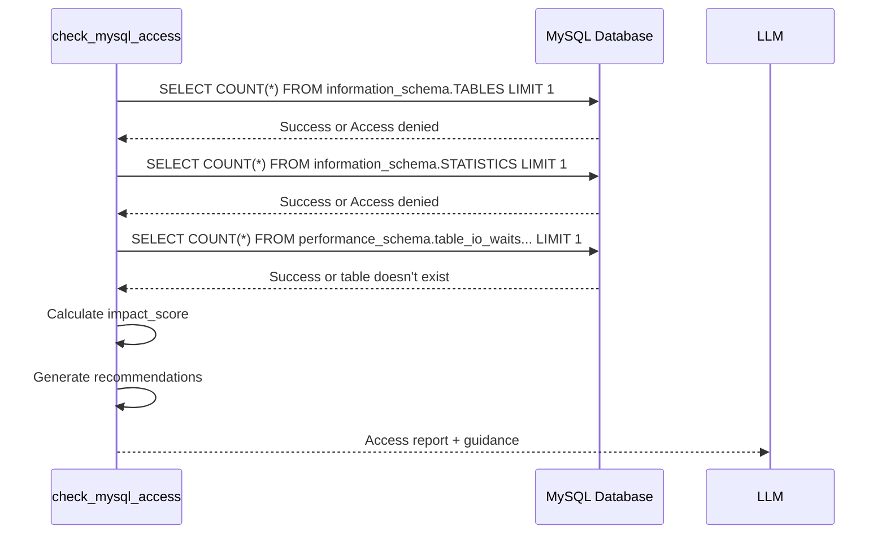

# check_mysql_access

**Category:** Access Verification  
**Database:** MySQL Only  
**Purpose:** Check database user permissions and access to MySQL information_schema and performance_schema

---

## Overview

The `check_mysql_access` tool verifies what MySQL metadata tables are accessible to the current database user. It checks both information_schema (for table/index metadata) and performance_schema (for runtime statistics).

**Why this matters:** MySQL analysis relies on information_schema for structure and performance_schema for actual index usage statistics. Limited access reduces analysis quality.

---

## When to Use

✅ **Use this tool when:**
- Analysis fails with "Access denied for table"
- You're unsure what permissions the MySQL user has
- Setting up a new MySQL connection
- Troubleshooting missing index usage statistics
- Before performing deep MySQL analysis

❌ **Don't use when:**
- You need to analyze a query (use `analyze_mysql_query` instead)
- Working with Oracle (use `check_oracle_access`)

---

## Parameters

| Parameter | Type | Required | Description |
|-----------|------|----------|-------------|
| `db_preset` | string | ✅ Yes | Database name from settings.yaml (e.g., "mysql_devdb03_avi") |

---

## Output Structure

```json
{
  "database": "mysql_devdb03_avi",
  "access_report": {
    "information_schema.TABLES": "✓ Accessible",
    "information_schema.STATISTICS": "✓ Accessible",
    "information_schema.COLUMNS": "✓ Accessible",
    "performance_schema.table_io_waits": "✓ Accessible",
    "performance_schema.events_statements": "✗ No access: performance_schema disabled"
  },
  "impact_score": 9,
  "impact_level": "EXCELLENT - All features available",
  "recommendations": [],
  "capability_matrix": {
    "basic_analysis": true,
    "index_analysis": true,
    "column_metadata": true,
    "index_usage_stats": true,
    "query_performance_history": false
  }
}
```

---

## Understanding the Access Report

### Critical Views (Must Have)

**information_schema.TABLES** - Impact Score: +3
- **Purpose:** Table-level statistics (row count, engine, data size)
- **Without:** Cannot perform any meaningful analysis
- **Grant:** Usually accessible by default to all users

**information_schema.STATISTICS** - Impact Score: +3
- **Purpose:** Index structure, columns, cardinality
- **Without:** Cannot recommend index optimizations
- **Grant:** Usually accessible by default

### Important Views (Highly Recommended)

**information_schema.COLUMNS** - Impact Score: +1
- **Purpose:** Column data types, nullable, defaults
- **Without:** Limited column-level analysis

**performance_schema.table_io_waits_summary_by_index_usage** - Impact Score: +2
- **Purpose:** Actual index read/write counts from production
- **Without:** Cannot identify unused indexes or hot spots
- **Requirement:** `performance_schema=ON` in MySQL config

### Optional Views (Nice to Have)

**performance_schema.events_statements_summary_by_digest** - Impact Score: +1
- **Purpose:** Query execution history and statistics
- **Without:** Cannot show historical query performance
- **Requirement:** `performance_schema=ON` + specific instrumentation

---

## Impact Score Interpretation

| Score | Level | Analysis Quality |
|-------|-------|-----------------|
| **9-10** | EXCELLENT | Full analysis with runtime statistics |
| **7-8** | GOOD | All metadata available, limited runtime data |
| **5-6** | MEDIUM | Basic structure analysis only |
| **3-4** | LIMITED | Minimal metadata access |
| **0-2** | CRITICAL | Cannot perform analysis |

---

## Common Scenarios

### Scenario 1: performance_schema Disabled

```python
result = check_mysql_access(db_preset="mysql_devdb03_avi")

# Output shows impact_score = 7 (GOOD)
# Missing: performance_schema.table_io_waits
```

**Interpretation:** This is common in older MySQL installations or Docker containers with default configs. Analysis will work but won't show actual index usage from production.

**Solution (if needed):**
```sql
-- In my.cnf or my.ini
[mysqld]
performance_schema = ON

-- Restart MySQL server
```

### Scenario 2: Restricted User

```python
result = check_mysql_access(db_preset="mysql_readonly")

# Output shows impact_score = 6 (MEDIUM)
# Missing: information_schema.STATISTICS access
```

**Action:** Request DBA to grant:
```sql
GRANT SELECT ON information_schema.STATISTICS TO 'readonly'@'%';
```

### Scenario 3: Full Access (Ideal)

```python
result = check_mysql_access(db_preset="mysql_devdb03_avi")

# Output shows impact_score = 10 (EXCELLENT)
# All views accessible
```

**Interpretation:** Optimal setup. All analysis features available.

---

## How Access Checking Works



**Key Points:**
- Each check queries only 1 row (`LIMIT 1`) for speed
- performance_schema checks may fail if disabled (not an error)
- Total execution time: < 500ms
- Safe to run repeatedly

---

## MySQL-Specific Considerations

### information_schema vs performance_schema

**information_schema:**
- Static metadata (structure, definitions)
- Always available (unless severely restricted)
- Shows what COULD be used

**performance_schema:**
- Runtime statistics (actual usage)
- Optional (can be disabled)
- Shows what IS BEING used in production
- Requires `performance_schema=ON`

### Why performance_schema Matters

**With performance_schema:**
```json
{
  "index_name": "idx_customer_id",
  "read_count": 0,         // This index is NEVER used!
  "write_count": 12453,    // But costs write performance
  "recommendation": "Consider dropping this unused index"
}
```

**Without performance_schema:**
```json
{
  "index_name": "idx_customer_id",
  "structure": "(customer_id)",
  "recommendation": "Index exists, but cannot verify if it's used"
}
```

---

## Related Tools

**Before check_mysql_access:**
- None (this is often the first tool to run)

**After check_mysql_access:**
- If impact_score ≥ 7: Proceed with `analyze_mysql_query`
- If impact_score < 7: Request missing grants or enable performance_schema
- After changes: Re-run `check_mysql_access` to verify

---

## Troubleshooting

### Issue: All checks fail with "Access denied"

**Cause:** Invalid credentials in settings.yaml  
**Fix:** Verify username/password/host/database in settings.yaml

### Issue: performance_schema tables don't exist

**Cause:** performance_schema is disabled in MySQL config  
**Fix:** Either:
1. Enable: `SET GLOBAL performance_schema=ON;` (requires restart)
2. Accept limitation: Analysis will work without runtime stats

### Issue: "Table doesn't exist" for performance_schema tables

**Cause:** MySQL version < 5.6 or MariaDB variant  
**Fix:** Check MySQL version: `SELECT VERSION();`
- MySQL 5.6+: Should have performance_schema
- MySQL 5.5 or older: Upgrade recommended
- MariaDB: May have different schema

---

## Example Usage

### Example 1: Pre-Analysis Check
```python
# Before analysis, verify access
access_report = check_mysql_access(db_preset="mysql_devdb03_avi")

if access_report["impact_score"] >= 7:
    # Proceed with full analysis
    analyze_mysql_query(
        sql_query="SELECT * FROM orders WHERE ...",
        db_preset="mysql_devdb03_avi",
        output_preset="standard"  # Include index usage
    )
else:
    # Use minimal preset (no runtime stats)
    analyze_mysql_query(
        sql_query="SELECT * FROM orders WHERE ...",
        db_preset="mysql_devdb03_avi",
        output_preset="minimal"
    )
```

### Example 2: Verify performance_schema

```python
result = check_mysql_access(db_preset="mysql_devdb03_avi")

if "performance_schema" in result["access_report"]:
    if "✓ Accessible" in result["access_report"]["performance_schema.table_io_waits"]:
        print("Runtime statistics available")
    else:
        print("Performance schema disabled - static analysis only")
```

---

## Performance Characteristics

- **Execution Time:** < 500ms
- **Database Impact:** Negligible (5 simple SELECT queries)
- **Token Cost:** ~400-600 tokens (compact report)
- **Caching:** Results valid for session

---

## Best Practices

1. **Run first:** Check access before attempting MySQL analysis
2. **Understand limitations:** Know if runtime stats are available
3. **Don't require perfection:** impact_score ≥ 7 is usually sufficient
4. **Document setup:** Note if performance_schema is enabled for each DB
5. **Graceful degradation:** Adjust `output_preset` based on access level

---

## Admin Notes

**Source Code:** `server/tools/mysql_access_check.py`  
**Dependencies:** `mysql_connector.connect()`, `mysql-connector-python`  
**Configuration:** None (uses global db settings)  
**Logging:** Logs all permission checks at INFO level

---

## Comparison with Oracle Access Check

| Feature | Oracle | MySQL |
|---------|--------|-------|
| Critical views | ALL_TABLES, ALL_INDEXES | information_schema.TABLES, STATISTICS |
| Optional views | DBA_SEGMENTS, V$PARAMETER | performance_schema.table_io_waits |
| Default access | Requires explicit grants | Usually open by default |
| Runtime stats | V$ views (requires grants) | performance_schema (may be disabled) |
| Typical score | 6-8 (production) | 7-10 (development) |
