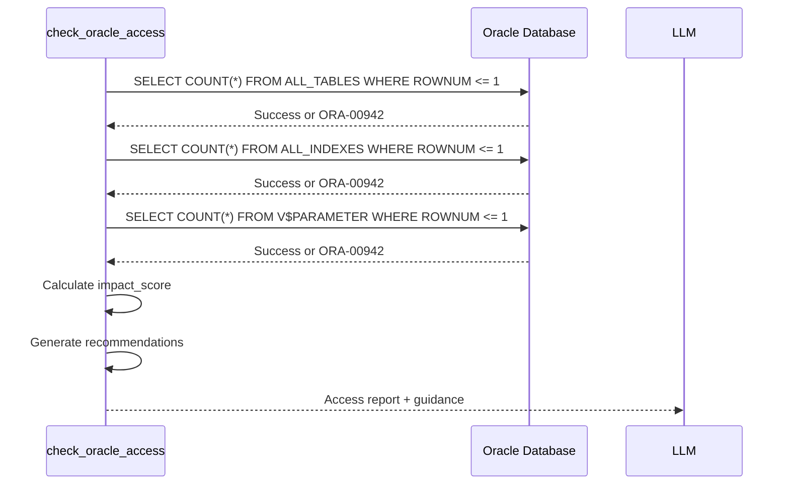

# check_oracle_access

**Category:** Access Verification  
**Database:** Oracle Only  
**Purpose:** Check database user permissions and access to Oracle data dictionary views

---

## Overview

The `check_oracle_access` tool verifies what Oracle data dictionary and performance views are accessible to the current database user. It returns a detailed report showing which metadata sources are available and how this impacts analysis quality.

**Why this matters:** The Performance MCP relies on various Oracle system views (ALL_*, DBA_*, V$*) to collect metadata. Limited access means limited analysis capabilities.

---

## When to Use

✅ **Use this tool when:**
- Analysis fails with "ORA-00942: table or view does not exist"
- You're unsure what permissions the database user has
- Setting up a new database connection
- Troubleshooting missing metadata in analysis results
- Before performing deep analysis on production databases

❌ **Don't use when:**
- You need to analyze a query (use `analyze_oracle_query` instead)
- Working with MySQL (use `check_mysql_access`)

---

## Parameters

| Parameter | Type | Required | Description |
|-----------|------|----------|-------------|
| `db_preset` | string | ✅ Yes | Database name from settings.yaml (e.g., "transformer_prod") |

---

## Output Structure

```json
{
  "database": "transformer_prod",
  "access_report": {
    "ALL_TABLES": "✓ Accessible",
    "ALL_INDEXES": "✓ Accessible",
    "ALL_IND_COLUMNS": "✓ Accessible",
    "ALL_CONSTRAINTS": "✓ Accessible",
    "ALL_TAB_COLUMNS": "✓ Accessible",
    "ALL_TAB_PARTITIONS": "✓ Accessible",
    "ALL_TAB_COL_STATISTICS": "✓ Accessible",
    "DBA_SEGMENTS": "✗ No access: ORA-00942",
    "V$PARAMETER": "✓ Accessible"
  },
  "impact_score": 8,
  "impact_level": "GOOD - Most features available",
  "recommendations": [
    "Grant SELECT on DBA_SEGMENTS for storage sizing (optional)"
  ],
  "capability_matrix": {
    "basic_analysis": true,
    "index_analysis": true,
    "column_statistics": true,
    "partition_info": true,
    "optimizer_params": true,
    "storage_sizing": false
  }
}
```

---

## Understanding the Access Report

### Critical Views (Must Have)

**ALL_TABLES** - Impact Score: +2
- **Purpose:** Table-level statistics (row count, blocks, last analyzed date)
- **Without:** Cannot determine table size or data freshness
- **Grant:** `GRANT SELECT ON SYS.ALL_TABLES TO user;`

**ALL_INDEXES** - Impact Score: +2
- **Purpose:** Index structure, clustering factor, uniqueness
- **Without:** Cannot recommend index optimizations
- **Grant:** `GRANT SELECT ON SYS.ALL_INDEXES TO user;`

### Important Views (Highly Recommended)

**ALL_IND_COLUMNS** - Impact Score: +1
- **Purpose:** Which columns are in each index
- **Without:** Cannot match predicates to available indexes

**ALL_CONSTRAINTS** - Impact Score: +1
- **Purpose:** Primary keys, foreign keys, unique constraints
- **Without:** Limited relationship mapping

**ALL_TAB_COLUMNS** - Impact Score: +1
- **Purpose:** Column-level statistics (distinct values, nulls)
- **Without:** Cannot detect data skew issues

**ALL_TAB_PARTITIONS** - Impact Score: +0.5
- **Purpose:** Partition strategy and pruning diagnostics
- **Without:** Cannot diagnose partition scan issues

**ALL_TAB_COL_STATISTICS** - Impact Score: +1
- **Purpose:** Histograms and data distribution
- **Without:** Limited cardinality estimation insights

### Optional Views (Nice to Have)

**DBA_SEGMENTS** - Impact Score: +0.5
- **Purpose:** Actual disk space usage (MB/GB)
- **Without:** Cannot show storage costs, but can estimate from blocks
- **Fallback:** Calculate from `blocks * block_size`

**V$PARAMETER** - Impact Score: +1
- **Purpose:** Optimizer configuration (mode, index cost adj, etc.)
- **Without:** Cannot explain why optimizer chose specific plan
- **Grant:** `GRANT SELECT ON SYS.V_$PARAMETER TO user;`

---

## Impact Score Interpretation

| Score | Level | Analysis Quality |
|-------|-------|-----------------|
| **9-10** | EXCELLENT | Full analysis with all features enabled |
| **7-8** | GOOD | Most features available, minor limitations |
| **5-6** | MEDIUM | Basic analysis works, some metadata missing |
| **3-4** | LIMITED | Plan generation only, limited recommendations |
| **0-2** | CRITICAL | Cannot perform meaningful analysis |

---

## Common Scenarios

### Scenario 1: New Database Setup

```python
result = check_oracle_access(db_preset="transformer_prod")

# Output shows impact_score = 4 (LIMITED)
# Missing: ALL_INDEXES, ALL_CONSTRAINTS, V$PARAMETER
```

**Action:** Request DBA to grant:
```sql
GRANT SELECT ON SYS.ALL_INDEXES TO transformer;
GRANT SELECT ON SYS.ALL_CONSTRAINTS TO transformer;
GRANT SELECT ON SYS.V_$PARAMETER TO transformer;
```

### Scenario 2: ORA-00942 During Analysis

User gets error during `analyze_oracle_query`:
```
ERROR: ORA-00942: table or view does not exist (ALL_IND_COLUMNS)
```

**Solution:**
```python
# Diagnose which view is missing
check_oracle_access(db_preset="transformer_prod")

# Send grant request to DBA
# After grants are applied, re-verify:
check_oracle_access(db_preset="transformer_prod")
# Impact score should increase
```

### Scenario 3: Production Read-Only User

```python
result = check_oracle_access(db_preset="transformer_prod")

# Output shows impact_score = 8 (GOOD)
# Has ALL_* views but missing DBA_SEGMENTS (expected for security)
```

**Interpretation:** This is normal for production read-only users. Analysis will work well, just without actual storage sizing.

---

## How Access Checking Works



**Key Points:**
- Each check queries only 1 row (`ROWNUM <= 1`) for speed
- No actual data is read, just permission verification
- Total execution time: < 1 second
- Safe to run repeatedly

---

## Related Tools

**Before check_oracle_access:**
- None (this is often the first tool to run)

**After check_oracle_access:**
- If impact_score ≥ 7: Proceed with `analyze_oracle_query`
- If impact_score < 7: Request missing grants from DBA
- After grants: Re-run `check_oracle_access` to verify

---

## Troubleshooting

### Issue: All checks fail with ORA-01017

**Cause:** Invalid credentials in settings.yaml  
**Fix:** Verify username/password/DSN in settings.yaml

### Issue: Impact score is 2 but user claims to have access

**Cause:** Connected to wrong database or schema  
**Fix:** Verify `db_preset` parameter matches intended database in settings.yaml

### Issue: DBA_SEGMENTS shows "insufficient privileges" but ALL_* works

**Cause:** This is normal - DBA_* views require DBA role  
**Fix:** Either:
1. Request `GRANT SELECT ANY DICTIONARY` (if security permits)
2. Accept fallback to block-based estimation (recommended)

---

## Example Usage

### Example 1: Pre-Analysis Check
```python
# Before deep analysis, verify access
access_report = check_oracle_access(db_preset="transformer_prod")

if access_report["impact_score"] >= 7:
    # Proceed with analysis
    analyze_oracle_query(
        sql_query="SELECT * FROM orders WHERE ...",
        db_preset="transformer_prod"
    )
else:
    # Report limitations to user
    print(f"Limited access (score: {access_report['impact_score']})")
    print("Recommendations:", access_report["recommendations"])
```

### Example 2: Automated Access Verification
```python
# Check all configured databases
for db_name in ["transformer_prod", "way4_docker8", "way4_docker7"]:
    result = check_oracle_access(db_preset=db_name)
    print(f"{db_name}: {result['impact_level']}")
```

---

## Performance Characteristics

- **Execution Time:** < 1 second
- **Database Impact:** Negligible (9 simple SELECT queries)
- **Token Cost:** ~500-800 tokens (compact report)
- **Caching:** Results valid for session (permissions rarely change mid-session)

---

## Best Practices

1. **Run first:** Always check access before attempting deep analysis
2. **Cache results:** No need to check repeatedly in same session
3. **Document grants:** Save required grants for new database setups
4. **Security-aware:** Don't request DBA_* access unless truly needed
5. **Fallback-friendly:** Design analysis to work with impact_score ≥ 5

---

## Admin Notes

**Source Code:** `server/tools/oracle_access_check.py`  
**Dependencies:** `db_connector.connect()`, `oracledb`  
**Configuration:** None (uses global db settings)  
**Logging:** Logs all permission checks at INFO level
